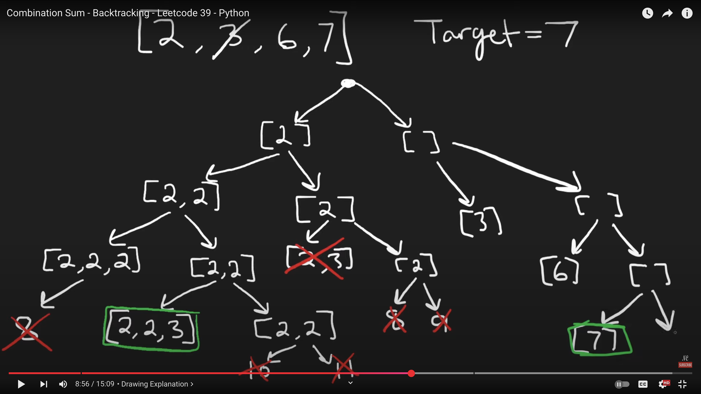

# 39. Combination Sum

🔗 **[Combination Sum](https://leetcode.com/problems/combination-sum/)**  
💡 **Difficulty:** Medium  
🛠 **Topics:** Backtracking, Recursion, DFS  

---

## Problem Statement

Given an array of **distinct** integers `candidates` and a target integer `target`, return a **list of all unique combinations** of `candidates` where the chosen numbers sum to `target`.  

You may return the combinations **in any order**.  

- The **same number** may be chosen from `candidates` an **unlimited** number of times.  
- Two combinations are **unique** if the **frequency** of at least one of the chosen numbers is different.  

**Test cases are generated** such that the number of unique combinations that sum up to `target` is **less than 150** combinations for the given input.

---

## Examples

### Example 1:
**Input:**  
```python
candidates = [2,3,6,7]
target = 7
```
**Output:**  
```python
[[2,2,3],[7]]
```
**Explanation:**  
- `2` and `3` are candidates, and `2 + 2 + 3 = 7`.  
- `7` is a candidate, and `7 = 7`.  
- These are the only two valid combinations.

### Example 2:
**Input:**  
```python
candidates = [2,3,5]
target = 8
```
**Output:**  
```python
[[2,2,2,2],[2,3,3],[3,5]]
```

### Example 3:
**Input:**  
```python
candidates = [2]
target = 1
```
**Output:**  
```python
[]
```
**Explanation:**  
There is no possible way to reach the target `1` using `2`.

---

## Constraints
- `1 <= candidates.length <= 30`
- `2 <= candidates[i] <= 40`
- All elements of `candidates` are **distinct**.
- `1 <= target <= 40`

---

## 🚀 Solution Approach (UMPIRE Method)

### 1️⃣ Understand
- We need to find **all possible combinations** that sum to `target`.
- A number in `candidates` can be used **multiple times**.
- The order of numbers in a combination does **not** matter.

---

### 2️⃣ Match
- This is a **Backtracking / Recursion** problem.
- We explore **two choices** at each step:
  - **Left Branch:** We **reuse** the current number (take it again).
  - **Right Branch:** We **skip** this number and move to the next.

---

### 3️⃣ Plan (Backtracking with DFS)
- **Recursive DFS function:** `dfs(i, cur, total)`  
  - `i` → Current index in `candidates`
  - `cur` → Current combination list
  - `total` → Sum of `cur`
- **Base Cases:**  
  - If `total == target`, store `cur` as a valid result.
  - If `total > target` or `i >= len(candidates)`, return.
- **Recursive Steps:**
  - **Left (Include candidates[i])**: Keep using the same value (move deeper).
  - **Right (Skip candidates[i])**: Move to the next index.

---

## 4️⃣ Implementation (Python Code)
see sol.py

---

## 5️⃣ Review
✅ **Tested Happy Paths:**  
- `candidates = [2,3,6,7], target = 7` → `[[2,2,3],[7]]`  
✅ **Edge Cases:**  
- `candidates = [2], target = 1` → `[]` (Cannot reach 1)  
- `candidates = [1], target = 1` → `[[1]]` (Minimal case)  
✅ **Walked through tree visualization to ensure correctness.**  

---

## 6️⃣ Evaluate
- **Time Complexity:** `O(2^T)`, where `T` is the target value  
  - Each number can be **included multiple times**, leading to exponential branching.
- **Space Complexity:** `O(T)`, where `T` is the recursion depth (max sum).

**Pros:**
- ✅ **Finds all valid combinations**
- ✅ **Efficient pruning with recursion**
- ✅ **Intuitive tree-based DFS approach**

**Cons:**
- ❌ **Exponential time complexity for large `target` values**

---

## 📝 Why Does This Work? (Tree Structure)
This problem is a classic **backtracking** problem.  
At each step, we either:
1. **Reuse** the current number (Left branch in tree).
2. **Skip** the current number (Right branch in tree).

This results in a **tree-like exploration** of all possible combinations:

```
             []
           /    \
         [2]      []
        /   \
     [2,2]   [2]
    /    \     \
 [2,2,2] [2,2,3]  [3]
```

✅ **The left side reuses elements**  
✅ **The right side skips elements**  

---

## 📝 Related Problems
- [40. Combination Sum II](https://leetcode.com/problems/combination-sum-ii/) – Same problem but numbers **cannot** be reused.
- [216. Combination Sum III](https://leetcode.com/problems/combination-sum-iii/) – Uses exactly `k` numbers.


## Appendix: Neetcode Visualization
