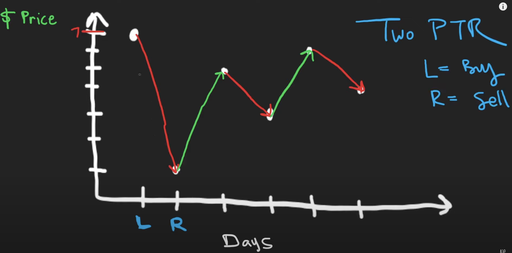

# 121. Best Time to Buy and Sell Stock

🔗 **[Best Time to Buy and Sell Stock](https://leetcode.com/problems/best-time-to-buy-and-sell-stock/)**  
💡 **Difficulty:** Easy  
🛠 **Topics:** Array, Two Pointers, Greedy  

---

## Problem Statement

You are given an array `prices` where `prices[i]` is the price of a given stock on the `i`th day.

You want to maximize your profit by choosing **a single day** to buy one stock and choosing **a different day in the future** to sell that stock.

Return the **maximum profit** you can achieve from this transaction. If you cannot achieve any profit, return `0`.

---

## Examples

### Example 1:
**Input:**  
```python
prices = [7,1,5,3,6,4]
```
**Output:**  
```python
5
```
**Explanation:**  
- Buy on day 2 (price = 1) and sell on day 5 (price = 6), profit = `6 - 1 = 5`.
- Buying on day 2 and selling on day 1 is not allowed (must buy before selling).

### Example 2:
**Input:**  
```python
prices = [7,6,4,3,1]
```
**Output:**  
```python
0
```
**Explanation:**  
- In this case, no transactions are done and the max profit = `0`.

---

## Constraints
- `1 <= prices.length <= 10^5`
- `0 <= prices[i] <= 10^4`

---

## 🚀 Solution Approach (UMPIRE Method)

### 1️⃣ Understand
1. Can we buy and sell on the same day?  
   - No, we must sell after we buy.
2. Can there be negative profit?  
   - No, we return `0` if no profitable transaction is possible.
3. Any time/space constraints?  
   - `O(N)` time complexity is preferred due to `10^5` input size.

### 2️⃣ Match
This is an **Array** problem, so we use:
- **Two Pointers**: One pointer to track the best buy price, and another to find the best sell price.

### 3️⃣ Plan
1. **Initialize two pointers:** `l = 0` (buy) and `r = 1` (sell).
2. **Iterate through prices** using `r`:
   - If `prices[l] < prices[r]`, calculate profit and update `maxP`.
   - If `prices[l] >= prices[r]`, move `l = r` to track a new minimum buy price.
3. Move `r` forward to continue checking.
4. Return `maxP` as the maximum possible profit.

---

## 4️⃣ Implementation
see sol.py

## 5️⃣ Complexity Analysis
Assume `N` is the number of days (length of `prices`).

- **Time Complexity:** `O(N)`  
  - Each element is processed once using two pointers.
- **Space Complexity:** `O(1)`  
  - Uses only a few extra variables.

---

## 6️⃣ Additional Notes
- The `l` pointer keeps track of the **best buying day**.
- The `r` pointer scans for a **better selling day**.
- Whenever a **lower price is found**, `l` updates to ensure the **cheapest buy price** is always used.

---

## 📝 Related Problems
- [122. Best Time to Buy and Sell Stock II](https://leetcode.com/problems/best-time-to-buy-and-sell-stock-ii/)
- [123. Best Time to Buy and Sell Stock III](https://leetcode.com/problems/best-time-to-buy-and-sell-stock-iii/)

## Appendix: Visualization

