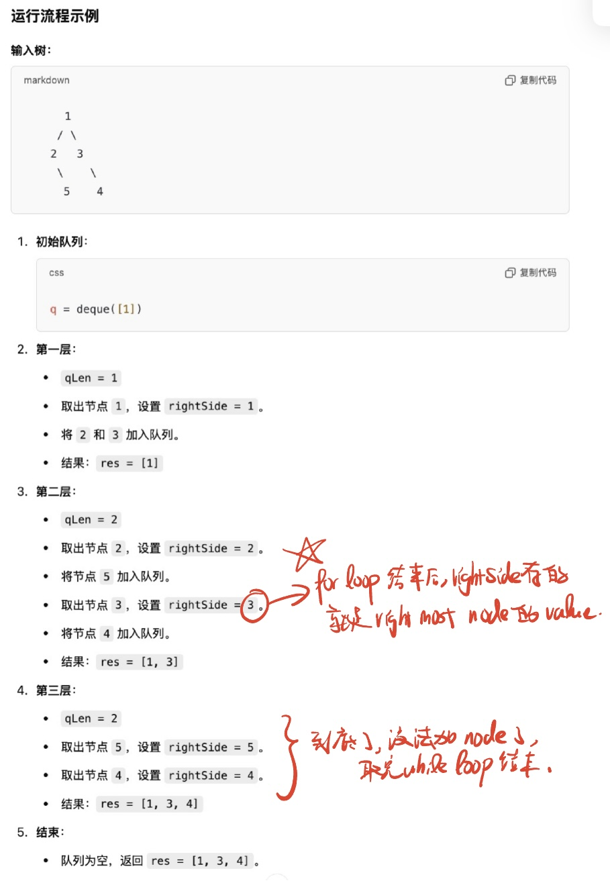

# 199. Binary Tree Right Side View

🔗 **[Binary Tree Right Side View](https://leetcode.com/problems/binary-tree-right-side-view/)**  
💡 **Difficulty:** Medium  
🛠 **Topics:** Tree, Breadth-First Search (BFS), Depth-First Search (DFS), Binary Tree  

---

## Problem Statement

Given the `root` of a binary tree, imagine yourself standing on the **right side** of it.  
Return the **values of the nodes** you can see, **ordered from top to bottom**.

---

## Examples

### Example 1:
**Input:**  
```
root = [1,2,3,null,5,null,4]
```
**Output:**  
```python
[1,3,4]
```
**Explanation:**  
- The rightmost nodes visible from top to bottom are `[1, 3, 4]`.

### Example 2:
**Input:**  
```
root = [1,2,3,4,null,null,5]
```
**Output:**  
```python
[1,3,5]
```
**Explanation:**  
- The rightmost nodes visible are `[1, 3, 5]`.

### Example 3:
**Input:**  
```
root = [1,null,3]
```
**Output:**  
```python
[1,3]
```

### Example 4:
**Input:**  
```
root = []
```
**Output:**  
```python
[]
```
**Explanation:**  
An empty tree has no visible nodes.

---

## Constraints
- `0 <= number of nodes <= 100`
- `-100 <= Node.val <= 100`

---

## 🚀 Solution Approach (UMPIRE Method)

### 1️⃣ Understand
1. **What does "right-side view" mean?**  
   - The nodes **visible when looking at the tree from the right side**.
2. **Can the tree be empty?**  
   - Yes, return `[]` if `root` is `None`.
3. **What traversal method works best?**  
   - **BFS (Level Order Traversal)** ensures **top-to-bottom order**.
   - **DFS (Right-First Preorder)** can also work.

### 2️⃣ Match
- This is a **Tree Traversal** problem.
- **BFS (Level Order)** is ideal for ensuring correct **top-to-bottom ordering**.
- **DFS (Right-First)** is an alternative approach.

### 3️⃣ Plan (BFS Approach)
1. Use a **queue (`deque`)** for **level-order traversal**.
2. At each level, track the **last node seen** (rightmost).
3. After traversing each level, add the **rightmost node's value** to the result list.
4. Continue until all levels are processed.

---

## 4️⃣ Implementation (BFS Approach)
see sol.py

## 5️⃣ Complexity Analysis
Assume `N` is the number of nodes.

- **Time Complexity:** `O(N)`  
  - Each node is **visited once** in BFS.
- **Space Complexity:** `O(N)`  
  - **Queue** stores nodes at each level.

---

## 6️⃣ Additional Notes
- **BFS (Queue) Approach** ensures **top-to-bottom order**.
- **DFS (Right-First Preorder) Alternative:**
  - Use a **depth-based** approach where right nodes are prioritized.

---

## 📝 Related Problems
- [102. Binary Tree Level Order Traversal](https://leetcode.com/problems/binary-tree-level-order-traversal/)
- [104. Maximum Depth of Binary Tree](https://leetcode.com/problems/maximum-depth-of-binary-tree/)


## Appendix: Dry Run:
